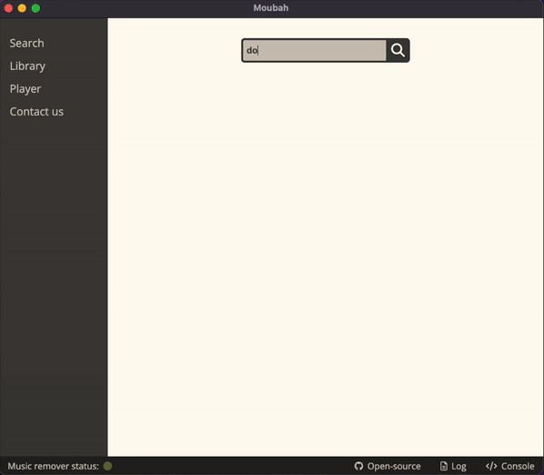

<h1 align="center">
    Moubah</br>
    🚧 (WIP) 🚧 </br>
</h1>
</br>

## ℹ️ Descritpion

Desktop application built with Electron to play YouTube videos without background music

<details>
<summary>🔎 Why this? Let's dive in...</summary>

</br>

> Desktop application ...

A web page would have been more convenient for the end user, but the processing of the video requires a high CPU and/or GPU consumption combined with non-javascript dependencies that cannot take place in a browser (client side).
A solution could have been to place this processing on the server side, but this would have had a considerable cost and the primary objective of this service is to be 100% free. This could happen in the future in cha Allah with the financial support of the community, but not now.

"What about a mobile app?"
Here, the problem with doing client-side processing is that the machine learning model trained to separate voice from audio is not currently compatible to run on a phone (as far as I know, this [PR](https://github.com/deezer/spleeter/issues/477) is still opened, this [project](https://github.com/FaceOnLive/Spleeter-Android-iOS) doesn't seem to work, and the processing time would have been to slow anyway).
As for the problem of server-side processing, it's the same as for the web version: not impossible, but it's not free

> ... built with Electron ...

A GUI built with a Python framework would have been technically simpler, but I turned to Electron to deepen my knowledge of the front end stack: JS / TS / React / HTML / CSS

> ... to play YouTube videos without background music

For the moment, only youtube videos are supported, but in the future, audios/videos can also be imported directly from the computer to have the background music removed, bi idhni Allah.
The app is centred around youtube as there is a lot of useful (e.g. tutorials) and/or entertaining (e.g. documentaries) content available on this platform with music in the background. This being haram in Islam, this app makes it... Moubah

</details>

</br>

<p align="center">
  
</p>

**Download the app** : 🍏 ~~Apple~~ | 🪟 ~~Windows~~ | 🐧 ~~Linux~~

</br>

## 📚 Tech Stack


</br>

### 🗺 Architecture diagram

<p align="center">
  
</p>

</br>

### 💻 Supported OS

| Windows | Mac (Intel) |                                 Mac (Apple silicon)                                  | Linux |
| :-----: | :---------: | :----------------------------------------------------------------------------------: | :---: |
|   ✅    |     📆      | ✅ ([Python 3.8.10](https://www.python.org/downloads/release/python-3810/) required) |  ❌   |

> ✅ Supported | 📆 Not tested yet | ❌ Not support plannned yet

</br>

## 🔧 Setup

### 📥 Download the source code

Use the `--recursive` option because of the git submodule:

```bash
git clone git@github.com:karim-bouchez/moubah.git --recursive
```

</br>

### 🔗 Install dependencies

Install npm packages:

```bash
npm install
```

</br>

Install the [music remover](https://github.com/karim-bouchez/music-remover) server:

```bash
cd music-remover
```

... then follow the "🔧 Setup" section [here](https://github.com/karim-bouchez/music-remover#-setup)

</br>

### ☄️ Run

```bash
npm start
# or debug it 🪲 with: npm run debug
```

</br>

### 📦 Create an executable file

```bash
npm run make
```

</br>

## 🛠 Troubleshooting

`no such file or directory ... protobuf/main.proto` on `npm run dev/prod` -> run: `git submodule update --init`

</br>

## 🎯 To-do list

-   [x] 🧼 Use TS instead of JS
-   [x] 🧼 Use React framework
-   [x] 🧼 Use tailwind css
-   [ ] 🧼 Use absolute path (instead of relative ones)
-   [ ] 🪲 Show a message when there is no internet connection (instead of a blank screen)
-   [ ] 🪲 On mac: quit when the close button is clicked
-   [ ] 🧼 Use Hexagonal architecture
-   [ ] 🆕 Improve UI/UX
-   [ ] 🪲 First installation/run is very long -> make a progress bar or something
-   [ ] 🆕 Support multi-languages (at least french and english)
-   [ ] 🆕 Add e2e tests
-   [ ] 🆕 improve logs (time + separate music-remover logs from moubah.log) and add several level of logs (like logging in Python)
-   [ ] 🆕 Setup CI/CD
-   [ ] 🪲 Audio result isn't smooth, find why...
-   [ ] 🆕 Add an uninstaller
-   [ ] 🆕 Notification system on new release
-   [ ] 🆕 Preview videos (without sound) on hover
-   [ ] 🆕 Be able to see "directly" the video (and don't have to wait until the whole video is processed)
-   [ ] 🆕 Be able to open Moubah from YouTube (see [here](https://docs.freetubeapp.io/usage/browser-extension/))
-   [ ] 🆕 Add an ML filter on thumbnail that blur thumbnails with women

> 🪲 Fix bug | 🆕 Add new feature | 🧼 Refactoring code
